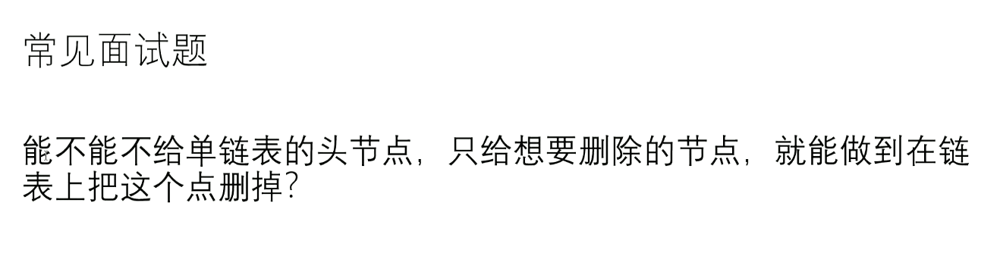

抖机灵：把下一个节点的值改到当前这个节点上，然后删除下一个节点，讲下一个节点后面的节点接到当前节点。

问题：如果节点是服务器的话会出问题，可能无法构造新的类或者对象，借尸还魂，最严重的问题无法删除最后一个节点。

正儿八经删一定需要头结点，这样肯定会出各种各样的问题。

# 递归

## 递归遍历的本质——递归区

### 任何递归函数都可以改成非递归——自己设计压栈来实现

### 非递归实现先序遍历，stack也只是模拟了程序堆栈的一部分而已，并不能等价于系统的程序堆栈，系统的程序堆栈在弹出现有堆栈会返回上一堆栈（弹出函数堆栈的调用堆栈），该堆栈可以使用自己堆栈目前已有的全部信息，但是常见语言类库的stack并不支持在不弹出的情况下访问堆栈顶部数据的内部信息，只要涉及到弹出后要访问堆栈顶部数据的内部信息的操作，单纯的用户层的堆栈都无法完美的模仿真正的程序的函数调用堆栈。同时系统的程序函数调用堆栈因为顺序执行的原因隐含了时间顺序这一变量（也就是执行过的无法再执行，也无需判断是否执行过，但是模拟的栈是做不到这一点的。）
